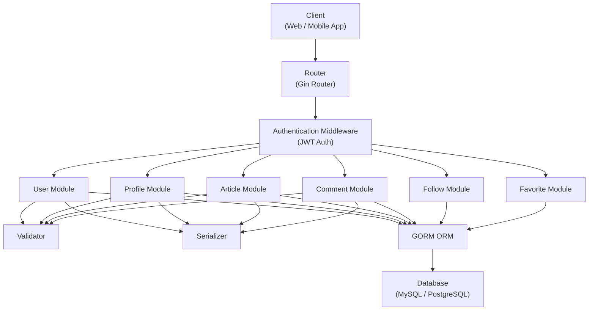

# 项目测试计划——RealWorld 项目

## 1. 项目范围

本项目以 **RealWorld（Conduit）**博客平台为目标应用，使用自主开发的 AutoTestDesign 工具开展测试分析与设计活动。测试范围覆盖目标应用的主要功能模块及关键质量属性，重点关注用户认证、文章管理、评论管理、用户关注与收藏等核心业务功能。

本次实践的详细测试设计选取 **Article Lifecycle（文章生命周期）** 模块作为重点对象，通过需求结构化、风险分析、黑盒测试设计和白盒建模等方法，验证系统功能正确性、接口行为一致性以及关键业务流程的可靠性。

总体目标包括：

- 验证目标应用核心功能满足需求规格说明；
- 识别高风险功能及潜在缺陷；
- 利用 AutoTestDesign 自动生成测试设计工件，提高测试效率；
- 评估测试覆盖情况，为后续自动化测试执行提供基础；
- 通过风险驱动测试方法提升测试资源利用率和测试质量。

本次测试计划覆盖以下主要功能模块：

### 功能性测试项（Functional Features）

| 功能模块                          | 主要功能                                   | 主要接口/对象                                                                                    | 测试关注点                                            |
| --------------------------------- | ------------------------------------------ | ------------------------------------------------------------------------------------------------ | ----------------------------------------------------- |
| 用户认证（Authentication）        | 用户注册、登录、身份认证、获取当前用户信息 | POST /api/users POST /api/users/login GET /api/user                                              | 身份认证正确性、JWT有效性、非法访问拦截、登录失败处理 |
| 用户资料（Profile）               | 查看和修改个人资料                         | GET /api/profiles/{username} PUT /api/user                                                       | 数据更新正确性、权限控制、数据持久化                  |
| 文章生命周期（Article Lifecycle） | 创建、查询、修改、删除文章                 | POST /api/articles GET /api/articles/{slug} PUT /api/articles/{slug} DELETE /api/articles/{slug} | CRUD正确性、输入验证、权限控制、数据持久化            |
| 评论管理（Comments）              | 添加评论、删除评论、查询评论               | POST /api/articles/{slug}/comments DELETE /api/articles/{slug}/comments/{id}                     | 评论关联正确性、删除权限控制、异常输入处理            |
| 用户关注（Follow）                | 关注用户、取消关注、查询关注状态           | POST /api/profiles/{username}/follow DELETE /api/profiles/{username}/follow                      | 用户关系维护、状态一致性、权限验证                    |
| 文章收藏（Favorite）              | 收藏文章、取消收藏、收藏统计               | POST /api/articles/{slug}/favorite DELETE /api/articles/{slug}/favorite                          | 收藏状态维护、统计一致性、重复操作处理                |
| Feed内容流（Feed）                | 获取个性化文章流                           | GET /api/articles/feed                                                                           | 内容过滤逻辑、排序逻辑、返回结果正确性                |

---

### 非功能性测试项（Non-Functional Features）

| 质量属性                    | 测试目标                 | 评价指标                   | 测试重点                        |
| --------------------------- | ------------------------ | -------------------------- | ------------------------------- |
| 安全性（Security）          | 保证系统免受未授权访问   | 权限控制正确率、认证成功率 | JWT认证、权限验证、非法访问拦截 |
| 可靠性（Reliability）       | 保证系统长期稳定运行     | 系统稳定性、数据一致性     | 异常处理、数据恢复、一致性验证  |
| 性能（Performance）         | 保证系统满足响应时间要求 | 响应时间、吞吐量、并发能力 | API性能、数据库查询效率         |
| 可用性（Availability）      | 保证核心服务持续可访问   | 服务可达率、故障恢复时间   | 服务稳定性、接口可访问性        |
| 可维护性（Maintainability） | 便于后续扩展与维护       | 模块耦合度、接口一致性     | 模块化设计、代码结构合理性      |
| 兼容性（Compatibility）     | 保证系统符合规范和标准   | API兼容性、数据格式兼容性  | REST规范、JSON格式兼容          |
| 可测试性（Testability）     | 支持自动化测试与缺陷定位 | 测试覆盖率、日志可观测性   | API可测试性、结果可验证性       |

---

## 2. 系统架构描述

RealWorld采用典型的三层Web架构（Three-Tier Architecture）。

### 主要组件描述

| 组件            | 作用             |
| --------------- | ---------------- |
| Router          | API路由分发      |
| Auth Middleware | JWT身份认证      |
| User Module     | 用户管理         |
| Profile Module  | 用户资料管理     |
| Article Module  | 文章生命周期管理 |
| Comment Module  | 评论管理         |
| Favorite Module | 收藏管理         |
| Follow Module   | 用户关注管理     |
| Serializer      | API响应格式化    |
| Validator       | 请求数据验证     |
| ORM (GORM)      | 数据访问层       |
| Database        | 数据持久化       |

---

## 3. 高级测试套件设计

本项目采用风险驱动测试（Risk-Based Testing）方法。

测试套件设计依据包括：

1. RealWorld（Conduit）需求规格说明
2. AutoTestDesign 生成的结构化需求（Structured Requirements）
3. 风险分析结果（Risk Analysis）
4. 黑盒测试设计结果（Black-Box Design）
5. 白盒建模结果（White-Box Modeling）

对于高风险需求优先分配更多测试资源，并采用多种测试技术进行覆盖；对于中低风险需求采用相对轻量的测试策略。

---

### 测试套件总体设计

| 测试套件                    | 测试目标                     | 风险等级 | 测试技术                  |
| --------------------------- | ---------------------------- | -------- | ------------------------- |
| TS-01 用户认证测试          | 验证登录、注册、JWT认证机制  | High     | 等价类划分、边界值分析    |
| TS-02 Article Lifecycle测试 | 验证文章创建、修改、删除流程 | High     | EP、BVA、决策表、状态迁移 |
| TS-03 权限控制测试          | 验证作者与非作者访问控制     | High     | EP、状态迁移              |
| TS-04 输入验证测试          | 验证非法输入处理             | High     | EP、BVA                   |
| TS-05 API契约测试           | 验证接口返回结构             | Medium   | API Contract Testing      |
| TS-06 数据持久化测试        | 验证数据库状态一致性         | Medium   | 场景测试                  |
| TS-07 错误处理测试          | 验证异常路径行为             | Medium   | Negative Testing          |
| TS-08 系统性能测试          | 验证系统响应能力             | Low      | Load Testing              |
| TS-09 安全性测试            | 验证认证与授权机制           | High     | Security Testing          |

---

### 各测试套件与技术选择(以TS-02 Article Lifecycle测试为例)

目标: 验证文章CRUD功能

#### 风险来源:

| 风险       |
| ---------- |
| 数据丢失   |
| 状态不一致 |
| 非法修改   |

#### 因此选用技术:

| 技术                | 原因                         |
| ------------------- | ---------------------------- |
| 等价类划分（EP）    | 合法与非法文章数据           |
| 边界值分析（BVA）   | title、description、body边界 |
| 决策表（DT）        | tagList组合逻辑              |
| 状态迁移测试（STT） | Article生命周期              |

### 测试套件示例（Article Lifecycle为例）

#### 对应需求

| Requirement             |
| ----------------------- |
| R1 创建文章必须认证     |
| R2 合法用户可以创建文章 |
| R5 标题不能为空         |
| R7 非作者不可修改文章   |
| R10 非作者不可删除文章  |

#### 对应风险

| Requirement | Risk             |
| ----------- | ---------------- |
| R1          | Authentication   |
| R5          | Input Validation |
| R7          | Authorization    |
| R10         | Authorization    |

#### 选择的测试技术

| Requirement | 技术         |
| ----------- | ------------ |
| R1          | 等价类划分   |
| R2          | 等价类划分   |
| R5          | 边界值分析   |
| R7          | 状态迁移测试 |
| R10         | 状态迁移测试 |

例如，对于 **R5（标题不能为空）**：

有效等价类：标题非空

无效等价类：标题为空

边界值：title = "" |title = "A" | title = 最长允许长度

通过 EP + BVA 的组合，可以以较少测试用例获得较高覆盖率，并优先覆盖风险分析中识别出的高风险需求。

## 4. 进度安排与检查清单

### 4.1 测试阶段安排

| **阶段 (Phase)** | **主要活动**                               | **测试级别**      | **目标**              | **输出物**         |
| ---------------- | ------------------------------------------ | ----------------- | --------------------- | ------------------ |
| **Phase 1**      | 阅读 TodoApp 代码与接口说明，确认测试范围  | 需求审查          | 明确测试对象和边界    | 测试范围说明       |
| **Phase 2**      | 使用 AutoTestDesign 导入需求并生成风险分析 | 静态测试/风险分析 | 识别高风险功能        | 风险评分表         |
| **Phase 3**      | 识别覆盖项并生成高级测试套件               | 测试设计          | 建立测试策略          | 测试套件设计表     |
| **Phase 4**      | 编写 PyTest 和 Flask Test Client 测试脚本  | 单元/接口测试     | 自动执行核心 API 测试 | 自动化测试脚本     |
| **Phase 5**      | 执行测试并记录结果                         | 系统测试          | 验证功能正确性        | 测试执行结果       |
| **Phase 6**      | 分析失败测试并补充测试用例                 | 回归测试          | 改进覆盖率和有效性    | 缺陷分析与改进记录 |
| **Phase 7**      | 整理测试计划、测试设计和演示材料           | 文档整理          | 形成最终交付物        | 报告与 PPT         |

### 4.2 测试级别与目标

| **测试级别**   | **测试对象**                 | **测试目标**                     | **工具/框架**              |
| -------------- | ---------------------------- | -------------------------------- | -------------------------- |
| **需求级测试** | 需求文本、接口说明、业务规则 | 确认需求可测试、规则清晰         | AutoTestDesign             |
| **单元测试**   | 校验函数、模型方法、状态规则 | 验证局部逻辑正确性               | PyTest                     |
| **接口测试**   | REST API endpoints           | 验证状态码、响应体、数据库效果   | PyTest + Flask Test Client |
| **系统测试**   | 完整 TodoApp API 流程        | 验证注册、登录、任务管理完整流程 | PyTest                     |
| **回归测试**   | 修复或修改后的核心功能       | 确认已有功能未被破坏             | PyTest                     |
| **非功能测试** | 性能、安全、可靠性           | 验证响应时间、非法访问和异常处理 | PyTest / coverage.py       |

## 5. 组织架构图

项目由一整套职责清晰的skill构成，其中核心的skill 划分：

1. **Orchestrator / Planner**
   - 负责整体流程
   - 决定调用哪个子 skill
   - 汇总最终结果
   - 承接人工 review / revision
   - 体现“designer participation”

2. **Requirement Structuring**
   - 读取需求文本 / CSV / 用户输入
   - 提取 requirement items、约束、条件、预期行为
   - 输出结构化需求结果

3. **Risk Analysis**
   - 对需求或模块进行风险打分
   - 给出 High / Medium / Low 优先级
   - 输出风险分析结果，供测试计划使用

4. **Black-box Design**
   - 生成等价类、边界值、决策表等黑盒测试设计
   - 输出测试用例、coverage items 和 traceability

5. **White-box Modeling**
   - 对重点模块生成状态迁移或逻辑路径
   - 作为加分项支持白盒测试设计

以上功能模块分别对应了每个成员各自的工作：

| 成员         | 主要负责           | 需要负责的具体工作                                                                                             | 主要交付                                               |
| :----------- | ------------------ | -------------------------------------------------------------------------------------------------------------- | ------------------------------------------------------ |
| 滕其峰，李然 | 总控与整合         | 开发 orchestrator、整合各 skill 输出、统一数据格式、运行最终全流程、汇总交付物                                 | README、最终汇总版工具结果、PPT 主线                   |
| 黄文         | 需求解析           | 开发 requirement structuring skill、整理 requirement input、优化该 skill prompt、运行 skill 生成结构化需求结果 | requirement input、requirement IDs、结构化需求结果     |
| 王思源       | 风险分析与测试计划 | 开发 risk analysis skill、优化该 skill prompt、运行 skill 生成风险结果、主写测试计划                           | 风险分析结果、风险分析报告、测试计划                   |
| 姜政言       | 黑盒测试设计       | 开发 black-box design skill、优化该 skill prompt、运行 skill 生成黑盒测试资产、整理 traceability               | coverage items、黑盒测试用例、详细设计文档中的黑盒部分 |
| 李然         | 白盒与执行验证     | 开发 white-box / test generation（可选）相关能力、选择测试框架、运行测试、整理结果                             | 白盒设计结果、可选测试脚本、执行结果、演示视频         |

每个成员使用 AutoTestDesign 工具按各自技能产出工件，风险分析结果直接影响测试优先级。黑盒设计结果用于自动化脚本生成。

---

## 6. 选定的测试框架及理由

- **框架**：PyTest + requests
- **理由**：
  - PyTest 支持参数化测试，适合大量 Coverage Item 的快速执行
  - requests 可直接调用 API 并验证响应
  - 易于与 AutoTestDesign 工具生成的 JSON 输出集成

AutoTestDesign 当前只生成测试设计，尚未自动执行测试，因此未采用自动化执行框架。

---

## 7. 成本估算

### 估算目标

估算范围包括：

- 需求分析
- 风险分析
- 测试设计
- 测试用例生成
- 测试文档整理

不包含：软件开发成本/被测系统部署成本/后续缺陷修复成本

---

### 手工测试成本估算

对于 Article Lifecycle 模块：

功能包括：CRUD

需求数量：12-16

最终测试设计成果：

- 18 个黑盒测试用例
- 12 条白盒路径
- 1 个状态迁移模型
- 1 个风险分析报告

按照普通测试工程师经验估算：

| 活动         | 人时     |
| ------------ | -------- |
| 阅读需求文档 | 2 h      |
| 提取需求     | 2 h      |
| 风险分析     | 2 h      |
| 等价类划分   | 2 h      |
| 边界值分析   | 1 h      |
| 决策表设计   | 2 h      |
| 状态迁移分析 | 3 h      |
| 测试用例编写 | 4 h      |
| 建立追踪矩阵 | 2 h      |
| 文档整理     | 2 h      |
| **总计**     | **20 h** |

---

### AutoTestDesign成本估算

使用 AutoTestDesign 后：

| 活动                         | 人时    |
| ---------------------------- | ------- |
| 准备需求输入                 | 1 h     |
| 执行 Requirement Structuring | 0.5 h   |
| 执行 Risk Analysis           | 0.5 h   |
| 执行 Black-Box Design        | 0.5 h   |
| 执行 White-Box Modeling      | 0.5 h   |
| 人工审查与修订               | 2 h     |
| 导出报告                     | 0.5 h   |
| **总计**                     | **5 h** |

---

### 人力成本对比

假设测试工程师成本：150 元/小时

则：

| 方法           | 人时 | 成本    |
| -------------- | ---- | ------- |
| 手工测试设计   | 20 h | 3000 元 |
| AutoTestDesign | 5 h  | 750 元  |

节省：

| 指标     | 数值    |
| -------- | ------- |
| 节省工时 | 15 h    |
| 节省比例 | 75%     |
| 节省成本 | 2250 元 |

$$CostSaving = \frac{3000-750}{3000}=75\% $$

### 资源成本估算

由于项目采用大语言模型生成测试设计，因此主要资源成本来自模型调用费用。LLM API : DeepSeek / Claude

### 效益分析

AutoTestDesign 的主要收益包括：

| 收益         | 说明                                   |
| ------------ | -------------------------------------- |
| 提高效率     | 自动完成需求解析与测试设计             |
| 提高一致性   | 统一输出格式与追踪关系                 |
| 提高覆盖率   | 自动结合 EP、BVA、DT、State Transition |
| 降低遗漏风险 | 自动建立需求到测试的映射               |
| 降低人力成本 | 显著减少测试设计工作量                 |

对于本项目的 Article Lifecycle 模块：

- 手工方式约需 20 人时；
- AutoTestDesign 约需 5 人时；
- 工时减少约 75%；
- 同时自动生成风险分析、黑盒设计和白盒模型，提高了测试设计的完整性和可追踪性。

| 指标     | 手工测试 | AutoTestDesign | 改善幅度 |
| -------- | -------- | -------------- | -------- |
| 需求分析 | 2 h      | 0.5 h          | 75%      |
| 风险分析 | 2 h      | 0.5 h          | 75%      |
| 测试设计 | 8 h      | 1 h            | 87.5%    |
| 文档整理 | 4 h      | 1 h            | 75%      |
| 总工时   | 20 h     | 5 h            | 75%      |
| 总成本   | 3000 元  | 750 元         | 75%      |
